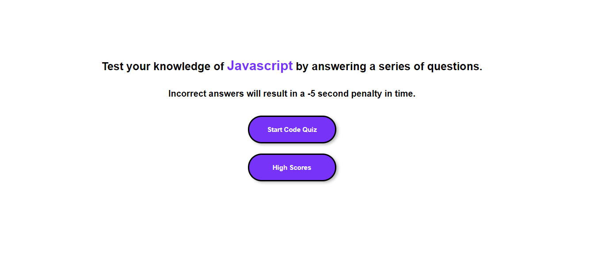
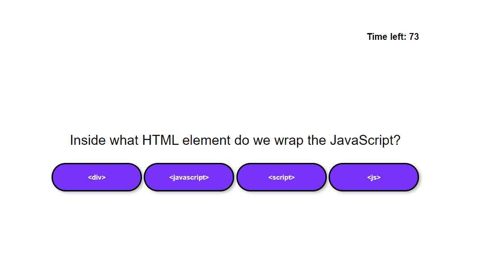
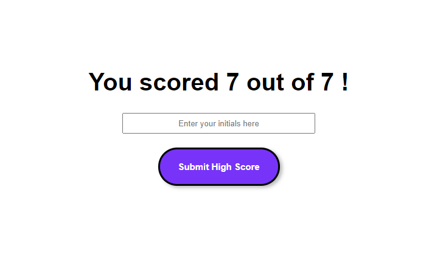
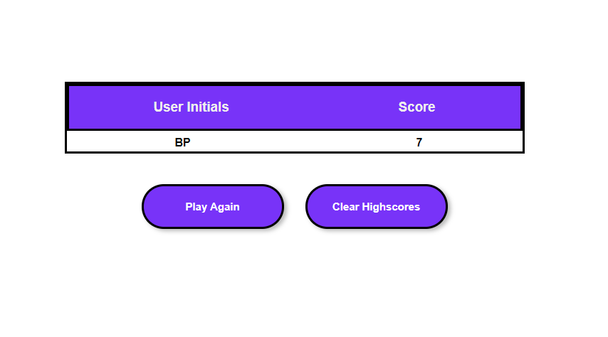

# coding-quiz
Homework-week-04


## DESCRIPTION OF TASK:
```
Build a timed coding quiz with multiple-choice questions that will run in the browser 
and will feature dynamically updated HTML and CSS powered by JavaScript code that you write. 
```

### User Story

```
AS A coding boot camp student
I WANT to take a timed quiz on JavaScript fundamentals that stores high scores
SO THAT I can gauge my progress compared to my peers
```

### Acceptance Criteria

```
GIVEN I am taking a code quiz
WHEN I click the start button
THEN a timer starts and I am presented with a question
WHEN I answer a question
THEN I am presented with another question
WHEN I answer a question incorrectly
THEN time is subtracted from the clock
WHEN all questions are answered or the timer reaches 0
THEN the game is over
WHEN the game is over
THEN I can save my initials and my score
```


## SCREENSHOTS:

The start page of the quiz includes simple directions, a button to start the quiz and a button to view high scores.



The quiz starts. It has four multiple choices and a timer on the top right. There are a total of seven questions.



Once the quiz has been completed, the player's score will show. The player will be allowed to enter their initials in the box and submit.



The high score page will keep all scores in the browser until the clear scores button is clicked.




## LINK TO DEPLOYED APPLICATION: